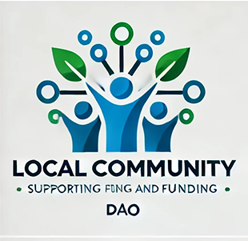

# LocalCommunityDAO

## Sobre
A LocalCommunityDAO é uma organização descentralizada autônoma criada para apoiar e financiar iniciativas comunitárias que promovam a melhoria da qualidade de vida e o engajamento da comunidade.

## Missão
"Apoiar e financiar iniciativas comunitárias que promovam a melhoria da qualidade de vida e o engajamento da comunidade."

## Como Participar
- **Servidor Discord**: [Link do Discord](#)
- **Twitter**: [@LocalCommunityDAO](https://twitter.com/LocalCommunityDAO)

## Doações
Para contribuir com a DAO, envie suas doações para a seguinte carteira:
- **Endereço da Carteira**: 0xYourWalletAddress

## Política de Remuneração
- **Detentores de Tokens de Governança**: Os detentores de tokens de governança (LCT) terão direito a votar em propostas e decisões importantes da DAO.
- **Tokens de Utilidade**: Os tokens de utilidade serão usados para pagar taxas e por serviços que a DAO possa fornecer. Os detentores desses tokens poderão usá-los para acessar serviços específicos oferecidos pela DAO.

## Criação da LLC
A LocalCommunityDAO será registrada como uma LLC assim que 70% dos fundos necessários forem arrecadados.

## GitHub Page
[Página da LocalCommunityDAO](https://seuusuario.github.io/LocalCommunityDAO)
